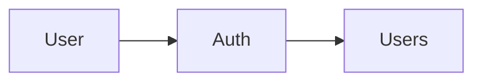

# muscle-boost-backend

<p align="center">
  
  
  
  
</p>

## About

REST API backend for planning strength workouts, logging training sessions, and tracking exercise progress over time. Users can build workout plans, execute them with real set/rep/weight data, browse a training diary, and view analytics on volume and load progression.

**v0.1.0** includes user registration, JWT authentication, and session management. Workout planning and analytics are planned.

## Features

### Available in v0.1.0

- **User accounts** — registration, JWT auth (access + refresh tokens), session management

### Planned

- **Workout plans** — exercises, sets, reps, weight, and rest time; muscle group and workout type detection; notes per plan or exercise
- **Training sessions** — run a plan on a chosen date, log actual performance, skip exercises
- **Training diary** — calendar of completed workouts, session details, search and filter (e.g. by muscle group)
- **Progress analytics** — exercise volume per muscle group over time, weight progression per exercise
- **Exercise catalog** — built-in exercises plus custom user-created entries
- **User profile** — profile management



## Tech stack

- NestJS (11)
- TypeScript (strict)
- TypeORM
- PostgreSQL (16+)
- @nestjs/swagger
- class-validator + class-transformer
- Passport + JWT (@nestjs/jwt, @nestjs/passport)
- argon2
- Jest
- ESLint + Prettier
- Husky (pre-commit hooks)

## Requirements

- Node.js 24+
- pnpm
- PostgreSQL 16+ (or Docker)

## Getting started

Clone the repo and install dependencies.

```
git clone https://github.com/evdmatvey/muscle-boost-backend.git
cd muscle-boost-backend
```

```
pnpm install
```

### Environment

Copy `.env.example` to `.env` and fill in the values:

| Group    | Variables                                                                                    |
| -------- | -------------------------------------------------------------------------------------------- |
| App      | `APP_PORT`, `APP_HOST`, `ALLOWED_ORIGIN`, `NODE_ENV`                                         |
| Database | `DB_HOST`, `DB_PORT`, `DB_USER`, `DB_PASSWORD`, `DB_NAME`                                    |
| JWT      | `JWT_ACCESS_SECRET`, `JWT_ACCESS_EXPIRES_IN`, `JWT_REFRESH_SECRET`, `JWT_REFRESH_EXPIRES_IN` |
| Auth     | `SESSION_LAST_ONLINE_THRESHOLD_MINUTES`, `REFRESH_ROTATION_GRACE_SECONDS`                    |

### Database

Start PostgreSQL (Docker):

```
pnpm docker:dev:up
```

Run migrations:

```
pnpm migration:run
```

### Development

Run in development mode.

```
pnpm start:dev
```

Run tests.

```
pnpm test
```

Run code format checker.

```
pnpm format
```

Run linter.

```
pnpm lint
```

Fix formatting and lint issues.

```
pnpm format:fix
pnpm lint:fix
```

### Build

Build the application and start in production mode.

```
pnpm build
pnpm start:prod
```

## API overview

- **Type:** REST API
- **Prefix:** `/api/v1`
- **Format:** JSON, UTF-8
- **Auth:** Bearer JWT (access token); refresh token via request body `{ "refreshToken": "..." }`
- **Swagger UI:** `http://localhost:<APP_PORT>/api/docs`

### Endpoints (v0.1.0)

| Method | Path                         | Auth   |
| ------ | ---------------------------- | ------ |
| POST   | `/api/v1/auth/register`      | Public |
| POST   | `/api/v1/auth/login`         | Public |
| POST   | `/api/v1/auth/refresh`       | Public |
| POST   | `/api/v1/auth/logout`        | Bearer |
| GET    | `/api/v1/auth/sessions`      | Bearer |
| DELETE | `/api/v1/auth/sessions/:id`  | Bearer |
| DELETE | `/api/v1/auth/sessions`      | Bearer |

Success responses: `{ "data": T }` or `{ "data": T[], "meta": { "page", "limit", "total" } }`

Error responses: `{ "statusCode", "message", "error", "details?": [{ "field", "message" }] }`

The `error` field is a stable machine-readable code (e.g. `INVALID_CREDENTIALS`, `EMAIL_ALREADY_IN_USE`).

## Project structure

Each module lives under `src/modules/<module>/` with controllers, services, repositories, DTOs, and entities.

| Module            | Status                          |
| ----------------- | ------------------------------- |
| `auth`            | available (v0.1.0)              |
| `users`           | internal (no public API)        |
| `user-profiles`   | planned                         |
| `exercises`       | planned                         |
| `workout-plans`   | planned                         |
| `workout-sessions`| planned                         |
| `analytics`       | planned                         |

## Releases

See [Releases](https://github.com/evdmatvey/muscle-boost-backend/releases) for version history and setup notes.

## Developers

- [evdmatvey](https://github.com/evdmatvey)

## License

Project muscle-boost-backend is distributed under the MIT license. See [LICENSE](LICENSE).
