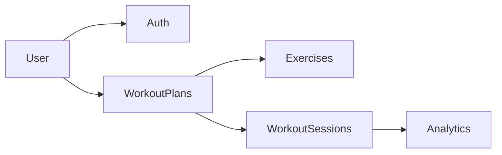

# muscle-boost-backend

<p align="center">
  
  
  
  
</p>

## About

REST API backend for planning strength workouts, logging training sessions, and tracking exercise progress over time. Users can build workout plans, execute them with real set/rep/weight data, browse a training diary, and view analytics on volume and load progression.

## Features

- **Workout plans** — exercises, sets, reps, weight, and rest time; muscle group and workout type detection; notes per plan or exercise
- **Training sessions** — run a plan on a chosen date, log actual performance, skip exercises
- **Training diary** — calendar of completed workouts, session details, search and filter (e.g. by muscle group)
- **Progress analytics** — exercise volume per muscle group over time, weight progression per exercise
- **Exercise catalog** — built-in exercises plus custom user-created entries
- **User accounts** — registration, JWT auth (access + refresh tokens), session management, profile



## Tech stack

**Current**

- NestJS (11)
- TypeScript (strict)
- Jest
- ESLint + Prettier
- Husky (pre-commit hooks)

**Planned**

- TypeORM
- PostgreSQL (16+)
- @nestjs/swagger
- class-validator + class-transformer

## Requirements

- Node.js 24+
- pnpm
- PostgreSQL 16+ (when the database layer is added)

## Getting started

Clone the repo and install dependencies.

```
git clone https://github.com/evdmatvey/muscle-boost-backend.git
cd muscle-boost-backend
```

```
pnpm install
```

### Environment

Copy `.env.example` to `.env` and fill in the values:

| Group    | Variables                                                                                    |
| -------- | -------------------------------------------------------------------------------------------- |
| App      | `APP_PORT`, `APP_HOST`, `ALLOWED_ORIGIN`, `NODE_ENV`                                         |
| Database | `DB_HOST`, `DB_PORT`, `DB_USER`, `DB_PASSWORD`, `DB_NAME`                                    |
| JWT      | `JWT_ACCESS_SECRET`, `JWT_ACCESS_EXPIRES_IN`, `JWT_REFRESH_SECRET`, `JWT_REFRESH_EXPIRES_IN` |

### Development

Run in development mode.

```
pnpm start:dev
```

Run tests.

```
pnpm test
```

Run code format checker.

```
pnpm format
```

Run linter.

```
pnpm lint
```

Fix formatting and lint issues.

```
pnpm format:fix
pnpm lint:fix
```

### Build

Build the application and start in production mode.

```
pnpm build
pnpm start:prod
```

## API overview

- **Type:** REST API
- **Prefix:** `/api/v1`
- **Format:** JSON, UTF-8
- **Auth:** Bearer JWT (access token); refresh token via request body `{ "refreshToken": "..." }`
- **Swagger UI:** planned at `/api/docs`

Success responses: `{ "data": T }` or `{ "data": T[], "meta": { "page", "limit", "total" } }`

Error responses: `{ "statusCode", "message", "error?", "details?": [{ "field", "message" }] }`

## Project structure

Domain modules (planned layout):

`auth` · `users` · `user-profiles` · `exercises` · `workout-plans` · `workout-sessions` · `analytics`

Each module lives under `src/modules/<module>/` with controllers, services, repositories, DTOs, and entities.

## Developers

- [evdmatvey](https://github.com/evdmatvey)

## License

Project muscle-boost-backend is distributed under the MIT license. See [LICENSE](LICENSE).
