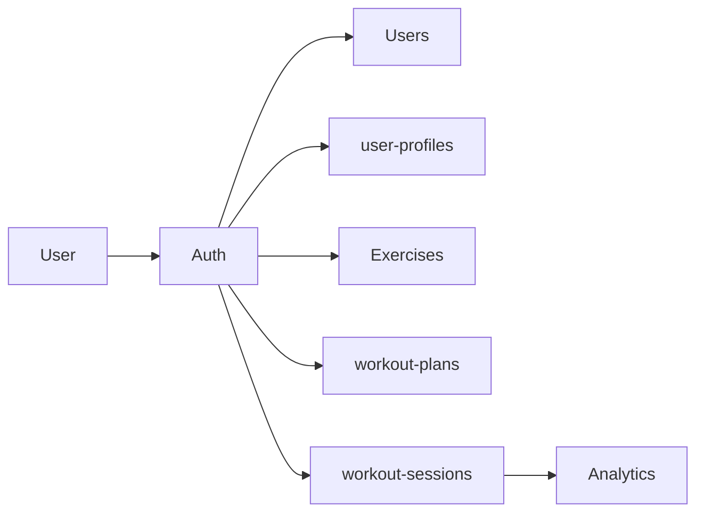

# muscle-boost-backend

<p align="center">
  
  
  
  
</p>

## About

REST API backend for planning strength workouts, logging training sessions, and tracking exercise progress over time. Users can build workout plans, execute them with real set/rep/weight data, browse a training diary, and view analytics on volume and load progression.

**v1.0.0** is the first client MVP: auth, profiles, exercise catalog, workout plans, training sessions/diary, and analytics — with staging/production deploy and basic observability.

## Features

### Available in v1.0.0

- **User accounts** — registration, JWT auth (access + refresh tokens), session management
- **User profile** — `displayName` and email via `/user-profiles/me`
- **Exercise catalog** — built-in exercises plus custom user-created entries
- **Workout plans** — exercises, sets, reps, weight, and rest time; server-computed workout type; notes
- **Training sessions** — run a plan or ad-hoc session, log actual performance, skip exercises
- **Training diary** — list/filter completed and in-progress workouts, session details
- **Progress analytics** — summary, exercise weight/volume progress, muscle-group volume over time


```mermaid
flowchart LR
  User --> Auth
  Auth --> Users
  Auth --> Profiles[user-profiles]
  Auth --> Exercises
  Auth --> Plans[workout-plans]
  Auth --> Sessions[workout-sessions]
  Sessions --> Analytics
```

## Tech stack

- NestJS (11)
- TypeScript (strict)
- TypeORM
- PostgreSQL (16+)
- @nestjs/swagger
- class-validator + class-transformer
- Passport + JWT (@nestjs/jwt, @nestjs/passport)
- argon2
- nestjs-pino / Pino
- prom-client / @willsoto/nestjs-prometheus
- Jest
- ESLint + Prettier
- Husky (pre-commit hooks)

## Requirements

- Node.js 24+
- pnpm
- PostgreSQL 16+ (or Docker)

## Getting started

Clone the repo and install dependencies.

```
git clone https://github.com/evdmatvey/muscle-boost-backend.git
cd muscle-boost-backend
```

```
pnpm install
```

### Environment

Copy `.env.example` to `.env` and fill in the values:

| Group    | Variables                                                                                               |
| -------- | ------------------------------------------------------------------------------------------------------- |
| App      | `APP_PORT`, `APP_HOST`, `ALLOWED_ORIGIN`, `NODE_ENV`, `APP_ENV`, `LOG_LEVEL`                            |
| Database | `DB_HOST`, `DB_PORT`, `DB_USER`, `DB_PASSWORD`, `DB_NAME`                                               |
| JWT      | `JWT_ACCESS_SECRET`, `JWT_ACCESS_EXPIRES_IN`, `JWT_REFRESH_SECRET`, `JWT_REFRESH_EXPIRES_IN`            |
| Auth     | `SESSION_LAST_ONLINE_THRESHOLD_MINUTES`, `REFRESH_ROTATION_GRACE_SECONDS`                               |

`NODE_ENV` — Node/Nest runtime mode (`development` / `production` / `test`).
`APP_ENV` — product environment (`local` / `staging` / `production`). Swagger is enabled when `APP_ENV` is not `production`.

### Database

Start PostgreSQL (Docker, local development):

```
pnpm docker:dev:up
```

Run migrations (local, TypeScript data-source):

```
pnpm migration:run
```

### Development

Run in development mode.

```
pnpm start:dev
```

Run tests.

```
pnpm test
```

Run code format checker.

```
pnpm format
```

Run linter.

```
pnpm lint
```

Fix formatting and lint issues.

```
pnpm format:fix
pnpm lint:fix
```

### Build

Build the application and start in production mode.

```
pnpm build
pnpm start:prod
```

## Docker: staging and production on one VPS

One `Dockerfile` and one `docker-compose.yml`. Staging and production are two Compose projects with separate env files, ports, databases, and volumes. Images are built in GitHub Actions and pulled from GHCR (no build on the server).

| Environment | Compose project | Env file          | Example host port | `APP_ENV`    | Image tag                 |
| ----------- | --------------- | ----------------- | ----------------- | ------------ | ------------------------- |
| Local DB    | (dev compose)   | `.env`            | `5432`            | `local`      | —                         |
| Staging     | `mb-staging`    | `.env.staging`    | `3001`            | `staging`    | `:staging`                |
| Production  | `mb-prod`       | `.env.production` | `3000`            | `production` | `:vX.Y.Z` / `:production` |

### Continuous deployment

| Trigger                         | Workflow             | Target       | GHCR tags               |
| ------------------------------- | -------------------- | ------------ | ----------------------- |
| Push / merge to `main`          | `deploy-staging.yml` | `mb-staging` | `staging`, `main-<sha>` |
| GitHub Release published (`v*`) | `deploy-prod.yml`    | `mb-prod`    | `vX.Y.Z`, `production`  |

Pipeline: build image -> push to `ghcr.io/<owner>/<repo>` -> SSH to VPS -> `docker compose pull` + `up -d --force-recreate` -> wait for `/api/health/ready`.

Migrations run automatically via the one-shot Compose service `migrate` before `app` starts. `--force-recreate` ensures migrations re-run on every deploy with the new image.

**Public repo note:** the GHCR package is private by default. After the first successful push, set the package visibility to **Public** (Packages -> settings) so the VPS can pull without login.

### GitHub configuration

**Secrets** (repository or environment `staging` / `production`):

| Secret         | Purpose                       |
| -------------- | ----------------------------- |
| `VPS_HOST`     | VPS hostname or IP            |
| `VPS_USER`     | SSH user (deploy, not root)   |
| `VPS_SSH_KEY`  | Private SSH key for that user |
| `VPS_SSH_PORT` | Optional; defaults to `22`    |

**Variables:**

| Variable          | Purpose                                                   |
| ----------------- | --------------------------------------------------------- |
| `VPS_DEPLOY_PATH` | App directory on VPS; default `/opt/muscle-boost-backend` |

Create GitHub Environments `staging` and `production` so deploy jobs can use them (optional protection rules on production).

### Bootstrap VPS (once)

1. Install Docker Engine + Compose plugin, nginx (or Caddy) + TLS, firewall (22/80/443 only).
2. Create a deploy user in the `docker` group; SSH key auth only.
3. Clone the repo (or copy `docker-compose.yml`) into `/opt/muscle-boost-backend`.
4. Copy env examples and fill secrets + `IMAGE`:

```
cp .env.staging.example .env.staging
cp .env.production.example .env.production
chmod 600 .env.staging .env.production
```

Set `IMAGE=ghcr.io/<owner>/muscle-boost-backend:staging` (and `:production` for prod). Replace `OWNER` with your GitHub owner (lowercase).

5. Point nginx to `127.0.0.1:3001` (staging) and `127.0.0.1:3000` (prod).
6. After the first GHCR push and public package visibility: pull and start once manually (or wait for the next CD run).

### Manual start / stop on the server

```
pnpm docker:staging:pull
pnpm docker:staging:up
pnpm docker:staging:down

pnpm docker:prod:pull
pnpm docker:prod:up
pnpm docker:prod:down
```

Equivalent raw commands:

```
docker compose -p mb-staging --env-file .env.staging pull
docker compose -p mb-staging --env-file .env.staging up -d --force-recreate --remove-orphans

docker compose -p mb-prod --env-file .env.production pull
docker compose -p mb-prod --env-file .env.production up -d --force-recreate --remove-orphans
```

Each stack runs: Postgres -> one-shot migrations -> app. App ports bind to `127.0.0.1` only; expose them via nginx.

Migrations inside the image:

```
pnpm migration:run:prod
```

(`node ./node_modules/typeorm/cli.js migration:run -d dist/database/data-source.prod.js`)

### Health checks

| Endpoint                | Purpose                                |
| ----------------------- | -------------------------------------- |
| `GET /api/health/live`  | Liveness (no DB); Docker `HEALTHCHECK` |
| `GET /api/health/ready` | Readiness (PostgreSQL via Terminus)    |

After deploy, wait until `/api/health/ready` returns 200.

### Metrics and observability

| Endpoint       | Purpose                                                         |
| -------------- | --------------------------------------------------------------- |
| `GET /metrics` | Prometheus exposition (Node.js defaults + HTTP request metrics) |

Scrape from the same host (`127.0.0.1:<APP_PORT>/metrics`). Do **not** expose `/metrics` publicly via nginx — keep it internal like the app port binding.

Collected now: process/heap/CPU/event-loop (`prom-client` defaults), `http_requests_total`, `http_request_duration_seconds` (labels: `method`, `route`, `status_code`; default labels `app`, `env`). Health and `/metrics` itself are excluded from HTTP metrics and access logs.

Local observability stack (Grafana, Prometheus, Loki, Promtail):

```
docker compose -f docker-compose.observability.yml up -d
```

Overview dashboard is provisioned from `observability/grafana/dashboards/`. Not part of the app image.

Local development still uses `pnpm docker:dev:up` (Postgres only) + `pnpm start:dev`.

## API overview

- **Type:** REST API
- **Prefix:** `/api/v1` (domain controllers); health at `/api/health/*`
- **Format:** JSON, UTF-8
- **Auth:** Bearer JWT (access token); refresh token via request body `{ "refreshToken": "..." }`
- **Swagger UI:** `http://localhost:<APP_PORT>/api/docs` (disabled when `APP_ENV=production`)
- **Health:** `GET /api/health/live`, `GET /api/health/ready`

### Endpoints (v1.0.0 overview)

Full request/response contracts: Swagger UI or project docs. Nested plan/session CRUD is omitted here for brevity.

| Area             | Methods | Paths (under `/api/v1` unless noted)                                      | Auth   |
| ---------------- | ------- | ------------------------------------------------------------------------- | ------ |
| Auth             | POST    | `/auth/register`, `/login`, `/refresh`, `/logout`                         | Mixed  |
| Sessions         | GET, DELETE | `/auth/sessions`, `/auth/sessions/:id`                                | Bearer |
| User profiles    | GET, PATCH | `/user-profiles/me`                                                    | Bearer |
| Exercises        | GET, POST | `/exercises`                                                            | Bearer |
| Workout plans    | CRUD + nested | `/workout-plans`, `…/exercises`, `…/sets`                           | Bearer |
| Workout sessions | CRUD + lifecycle + nested | `/workout-sessions`, `…/start|complete|cancel`, `…/exercises`, `…/sets` | Bearer |
| Analytics        | GET     | `/analytics/summary`, `/exercise-progress`, `/muscle-group-volume`        | Bearer |
| Health           | GET     | `/api/health/live`, `/api/health/ready`                                   | Public |
| Metrics          | GET     | `/metrics`                                                                | Public (keep internal) |

Success responses: `{ "data": T }` or `{ "data": T[], "meta": { "page", "limit", "total" } }`

Error responses: `{ "statusCode", "message", "error", "details?": [{ "field", "message" }] }`

The `error` field is a stable machine-readable code (e.g. `INVALID_CREDENTIALS`, `EMAIL_ALREADY_IN_USE`).

## Project structure

Each module lives under `src/modules/<module>/` with controllers, services, repositories, DTOs, and entities.

| Module             | Status                   |
| ------------------ | ------------------------ |
| `auth`             | available                |
| `users`            | internal (no public API) |
| `user-profiles`    | available                |
| `exercises`        | available                |
| `workout-plans`    | available                |
| `workout-sessions` | available                |
| `analytics`        | available                |
| `health`           | available                |
| `metrics`          | available                |

## Releases

See [CHANGELOG.md](CHANGELOG.md) and [Releases](https://github.com/evdmatvey/muscle-boost-backend/releases) for version history.

## Developers

- [evdmatvey](https://github.com/evdmatvey)

## License

Project muscle-boost-backend is distributed under the MIT license. See [LICENSE](LICENSE).
